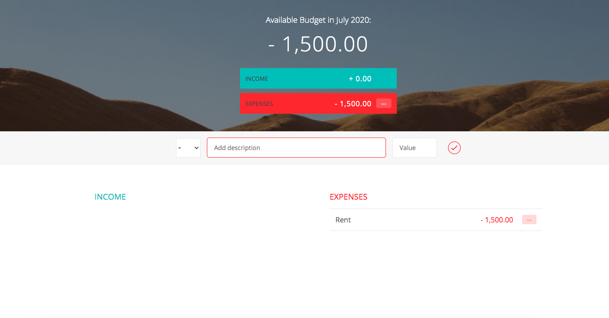

# Budget-App

This  application  allows users to keep track of there income and expenses to   calculating their budget. The budget app adds and subtracks their finances and then displays the total and current date on top of the page. It shows the percent of the expenses spent compared to their income and the value input will change color to green if the user is putting in an income or red if the user is putting in an expense. The user can also delete their incomes and expenses.

 ## Click [here](https://brianlevin.github.io/Budget-App/) for the live app. 

Here is the Home page:

The user  spends money and which creates an expense:

The user earns money and adds income to their budget:

The user can delete  income or expense values from their budget:

##  Libraries frameworks:
- HTML
- CSS
- Javascript

## Email

bml201095@gmail.com
